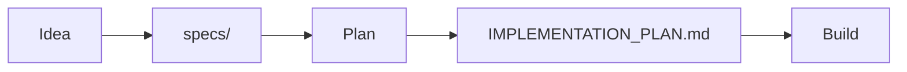

Minimal template for starting a new project built by Ralph and Claude Code. 

Based on and inspired by:
- https://github.com/ghuntley/how-to-ralph-wiggum
- https://ghuntley.com/solana/
- https://www.youtube.com/watch?v=4Nna09dG_c0




```sh
# create your project directory
mkdir your-project
cd your-project

# get this template
curl -L https://github.com/zcox/ralph-template/archive/HEAD.tar.gz | tar xz --strip-components=1

# delete some junk
rm ralph_factory.png README.md

# version control is important
git init
git add . && git commit -m "first"

# create your first idea (edit this file however you want)
echo "describe your idea in raw notes" > ideas/1.md

# tell claude to turn your idea into specs
claude
> /specs ideas/1.md

# tell ralph to plan
./step-plan.sh

# tell ralph to build
./step-build.sh

# when you trust ralph
./loop-build.sh 10

# iterate on PROMPT_plan.md and PROMPT_build.md to customize for your project
```
