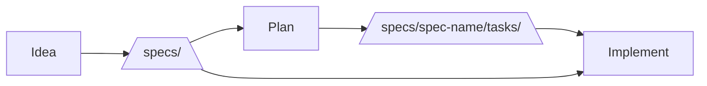

Minimal template for starting a new project built by Ralph and Claude Code. 

Based on and inspired by:
- https://github.com/ghuntley/how-to-ralph-wiggum
- https://ghuntley.com/solana/
- https://www.youtube.com/watch?v=4Nna09dG_c0




```sh
# create your project directory
mkdir your-project
cd your-project

# get this template
curl -L https://github.com/zcox/ralph-template/archive/HEAD.tar.gz | tar xz --strip-components=1

# skill that teaches claude to use the web app in a browser
mkdir -p .claude/skills/agent-browser
curl -o .claude/skills/agent-browser/SKILL.md https://raw.githubusercontent.com/vercel-labs/agent-browser/main/skills/agent-browser/SKILL.md

# delete some junk
rm ralph_factory.png README.md

# version control is important
git init
git add . && git commit -m "first"

# create your first idea (edit this file however you want)
echo "describe your idea in raw notes" > ideas/1.md

# tell claude to turn your idea into specs
claude "/specify-idea ideas/1.md"

# now look in specs/ and iterate on them with CC until you're happy

# plan tasks for the highest priority spec. you can run this a few times to fill things out.
claude "/plan-next-spec"

# now read through the tasks and iterate with CC until you're happy

# tell ralph to implement the next task
./step.sh

# when you trust ralph, send him off to impelement many tasks
./loop.sh 10

# check on Ralph's work every so often, and steer him back on-track as needed

# iterate on the skills so they work better for your project
```
