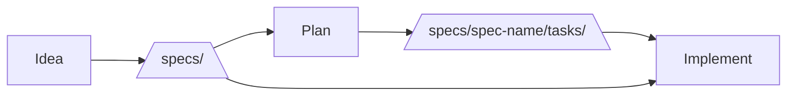

Minimal template for starting a new project built by Ralph and Claude Code. 

Based on and inspired by:
- https://github.com/ghuntley/how-to-ralph-wiggum
- https://ghuntley.com/loop/
- https://www.youtube.com/watch?v=4Nna09dG_c0



```mermaid
graph LR
    A[Idea] --> B[/specs/\]
    B --> C[Plan]
    C --> D[/specs/spec-name/tasks/\]
    D --> E[Implement]
    B --> E
```

```sh
# create your project directory
mkdir your-project
cd your-project

# get this template
curl -L https://github.com/zcox/ralph-template/archive/HEAD.tar.gz | tar xz --strip-components=1

# skill that teaches claude to use the web app in a browser
mkdir -p .claude/skills/agent-browser
curl -o .claude/skills/agent-browser/SKILL.md https://raw.githubusercontent.com/vercel-labs/agent-browser/main/skills/agent-browser/SKILL.md

# delete some junk
rm ralph_factory.png README.md

# version control is important
git init
git add . && git commit -m "first"

# create your first idea (edit this file however you want)
echo "describe your idea in raw notes" > ideas/1.md

# tell claude to turn your idea into specs
claude "/specify-idea ideas/1.md"

# now look in specs/ and iterate on them with CC until you're happy

# plan tasks for the highest priority spec. you can run this a few times to fill things out.
claude "/plan-next-spec"

# now read through the tasks and iterate with CC until you're happy

# tell ralph to implement the next task
./step.sh

# when you trust ralph, send him off to implement many tasks
./loop.sh 10

# exit early if ralph signals all tasks are done
./loop.sh -d 10

# check on Ralph's work every so often, and steer him back on-track as needed

# iterate on the skills so they work better for your project
```

## Meta Scripts

### scripts/meta/ralph-init.sh

Bootstraps a new project from ralph-template. Given a project name and an idea (from a file, stdin, or `-m`), it creates the project directory, downloads and unpacks ralph-template, adds the agent-browser skill, writes the idea to `ideas/<project-name>.md`, and initializes a git repository.

```sh
scripts/meta/ralph-init.sh my-app ideas/my-app.md
scripts/meta/ralph-init.sh my-api -m "REST API for managing widgets"
echo "Build a CLI tool" | scripts/meta/ralph-init.sh my-cli -
```

Options: `-d <dir>` for parent directory, `-c <file>` for a custom `CLAUDE.md`, `-t <dir>` for a local template path instead of cloning from GitHub.

## Concurrency

What can be done in parallel?
- `claude "/specify-idea ideas/1.md"`: specifying an idea to create specs
- `claude "/plan-next-spec"`: plan a spec to create tasks
- `./loop.sh n`: implement next task

## Optimization

What needs to be optimized in `implement-next-task`?
